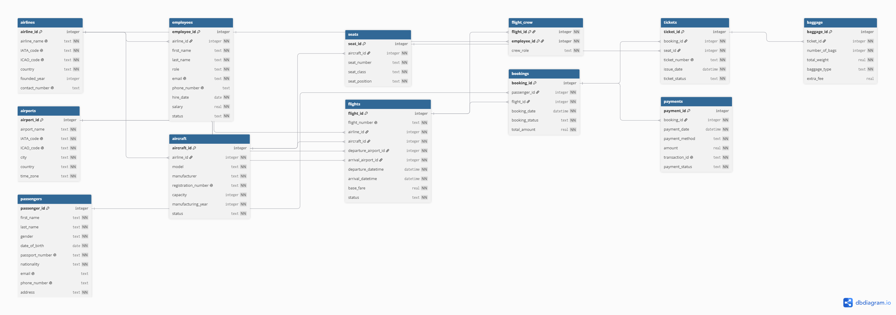

# Airline Reservation Management System

## Overview

The **Airline Reservation Management System** is a relational database project developed using **SQLite** for the **CS50 SQL Final Project**. It is designed to manage the core operations of an airline reservation system, including airlines, airports, aircraft, employees, passengers, flights, bookings, tickets, payments, crew assignments, baggage, and seating.

The project demonstrates the application of relational database design principles through normalization, foreign key relationships, constraints, indexes, and SQL views to ensure data integrity and efficient data retrieval.

---

## Features

- Manage airline and airport information
- Store aircraft and employee records
- Register passengers
- Schedule and manage flights
- Create passenger bookings
- Issue tickets
- Process payments
- Assign crew members to flights
- Store baggage information
- Retrieve data using SQL views
- Maintain data integrity using constraints and foreign keys

---

## Technologies Used

- SQLite
- SQL
- DBML
- dbdiagram.io

---

## Database Structure

The database consists of **12 relational tables**:

- Airlines
- Airports
- Aircraft
- Employees
- Passengers
- Flights
- Seats
- Bookings
- Tickets
- Payments
- Flight_Crew
- Baggage

These tables are connected using primary keys and foreign keys to maintain referential integrity and reduce data redundancy.

---

## Entity Relationship Diagram



---

## Views

The project includes four SQL views:

- **available_flights** – Displays available flights with airline and airport information.
- **passenger_bookings** – Displays booking details together with passenger and flight information.
- **flight_crew_details** – Displays crew members assigned to each flight.
- **payment_summary** – Displays payment information for passenger bookings.

---

## Indexes

Indexes were created on frequently queried foreign key columns to improve query performance:

- `aircraft.airline_id`
- `bookings.passenger_id`
- `bookings.flight_id`
- `flights.airline_id`
- `flights.departure_airport_id`
- `flights.arrival_airport_id`

---

## Project Structure

```text
.
├── schema.sql
├── queries.sql
├── DESIGN.md
├── README.md
└── erd.png
```

---

## How to Run

Create the database:

```bash
sqlite3 airline.db < schema.sql
```

Run the sample queries:

```bash
sqlite3 airline.db < queries.sql
```

---

## Documentation

A complete explanation of the database design, entities, relationships, design decisions, optimizations, and limitations is available in **DESIGN.md**.

---

## Author

**Mubashira Aqeel**

Developed as the **CS50 SQL Final Project**.
